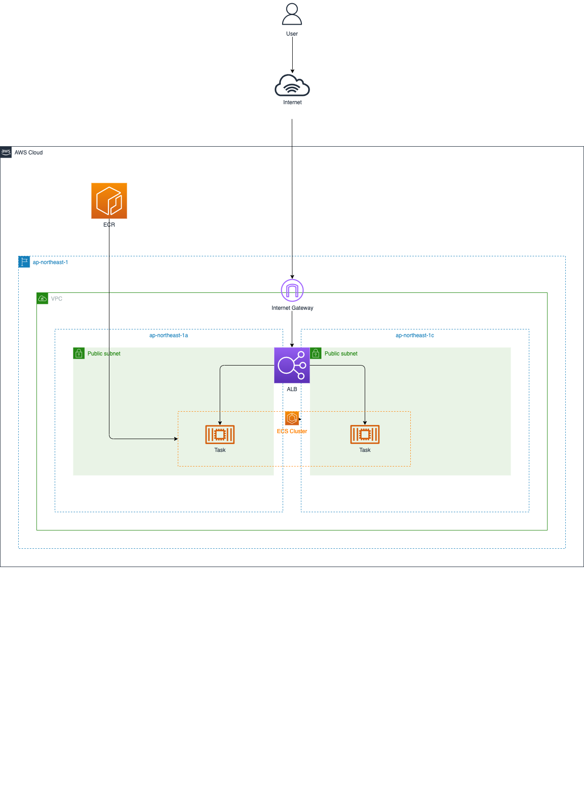

# cdk-microservices-template

## Overview

This repository contains cdk template for microservices architecture.

&emsp;

## Diagram



## Required

- [AWS CLI](https://aws.amazon.com/cli) - v2 or later
- [AWS CDK](https://aws.amazon.com/jp/cdk) - v2 or later
- [Node.js](https://nodejs.org/ja) - v16 or later
- [TypeScript](https://www.typescriptlang.org/) - v4 or later

## Getting Started

1. Clone this repository.

```shell
$ cd ~ && git clone https://github.com/tsukuboshi/cdk-microservices-template
```

2. Install npm packages.

```
$ npm install
```

3. If this is your first CDK deployment, run this command only once.

```
$ cdk bootstrap
```

4. Deploy CDK Code.


```
$ cdk deploy
```
